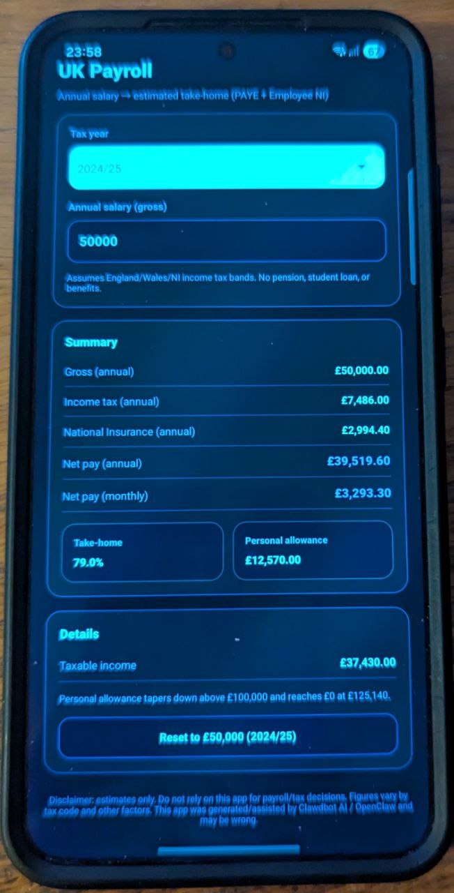

# UK Payroll App (2019/20–2024/25) — Expo (TypeScript)

A simple UK payroll/take‑home pay estimator for UK tax years **2019/20 through 2024/25**.



## What it does
- Input: **Annual gross salary**
- Output:
  - Personal Allowance (incl. taper above £100k)
  - Estimated Income Tax (PAYE bands: England/Wales/NI)
  - Estimated Employee National Insurance
  - Net annual + net monthly

## Run

```bash
cd uk-payroll-app
npm install
npx expo start
```

## Disclaimer

This app is provided for **informational and educational purposes only**.

- **Do not rely on this app for payroll, tax, or financial decisions.**
- Calculations may be **incorrect, incomplete, or outdated**.
- UK payroll depends on many factors (tax code, pension, student loan, benefits, pay frequency, employer settings, etc.).

This project was generated/assisted by **Clawdbot AI / OpenClaw** and may contain mistakes.

If you need accurate figures, use official sources or consult a qualified accountant/payroll professional.

(Full text: see `DISCLAIMER.md`.)
